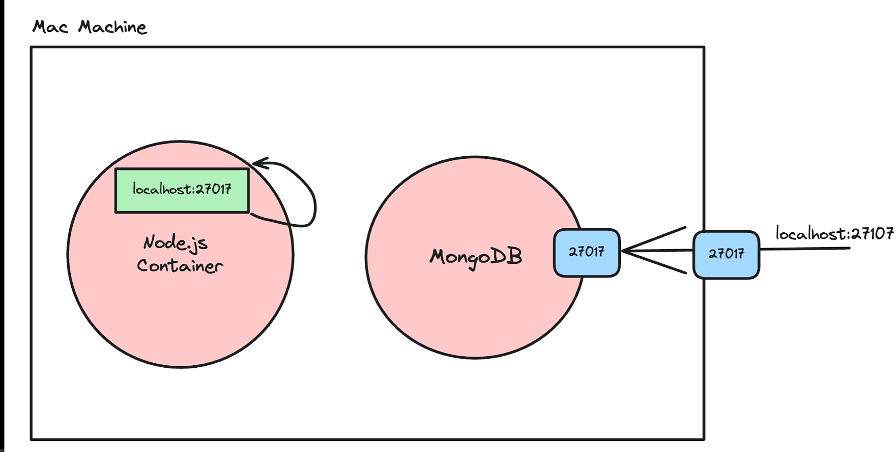
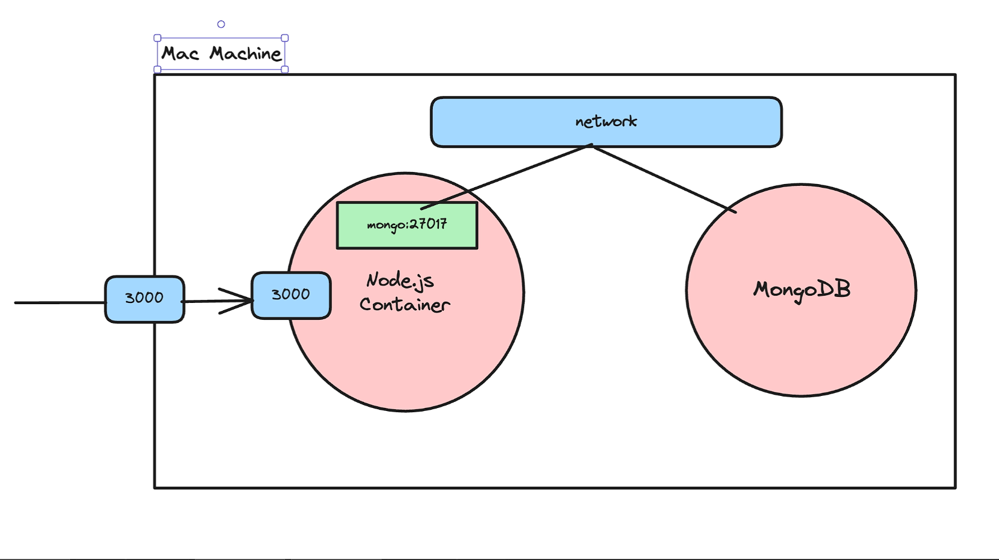

# 🐳 Docker Notes for Node.js Applications

## 1. Basic Docker Commands

### Check Running Containers

```bash
docker ps
```

Shows all currently running containers.

---

### Run a Container from an Existing Image

```bash
docker run <image-name>
```

Example:

```bash
docker run hello-world
```

Docker creates and starts a container using the specified image.

---

# Understanding a Dockerfile

## Base Image

```dockerfile
FROM node:22
```

This is the base image.

* Docker first pulls the Node.js image from Docker Hub.
* We then build our own image on top of this image.
* Think of it as the operating system + Node.js already installed.

  


---

## Working Directory

```dockerfile
WORKDIR /app
```

Sets the working directory inside the container.

Any future commands like:

```dockerfile
COPY
RUN
CMD
```

will execute relative to `/app`.

So our application source code will live inside:

```text
/app
```

---

## Copying Files

```dockerfile
COPY . .
```

Meaning:

```text
Current Project Folder (Host)
          ↓
      /app (Container)
```

This copies all files from the current directory into `/app`.

### Problem

It also copies:

```text
node_modules
.git
.env
```

which unnecessarily increases image size.

---

## Using .dockerignore

Create:

```text
.dockerignore
```

Example:

```text
node_modules
.git
.env
```

Now Docker will ignore these files/folders while copying.

---

## Better Approach

Instead of copying everything first:

```dockerfile
COPY package*.json ./

RUN npm install

COPY . .
```

Why?

1. Copy package files.
2. Install dependencies inside container.
3. Copy remaining source code.

Benefits:

* Smaller image size.
* Faster rebuilds due to Docker caching.
* Avoids copying host machine's `node_modules`.

---

## Installing Dependencies

```dockerfile
RUN npm install
```

Runs during image build.

Docker creates a layer where all dependencies are installed.

---

## Exposing a Port

```dockerfile
EXPOSE 3000
```

Indicates that the application listens on port:

```text
3000
```

inside the container.

This does **not** publish the port automatically.

---

## Starting the Application

```dockerfile
CMD ["node", "index.js"]
```

This command runs when the container starts.

Equivalent to:

```bash
node index.js
```

inside the container.

---

## Complete Example Dockerfile

```dockerfile
FROM node:22

WORKDIR /app

COPY package*.json ./

RUN npm install

COPY . .

EXPOSE 3000

CMD ["node", "index.js"]
```

---

# Build and Run Flow

## Step 1: Build Image

```bash
docker build -t hello_world .
```

Docker will:

1. Pull base image.
2. Create `/app`.
3. Copy files.
4. Install dependencies.
5. Create final image.

---

## Step 2: Run Container

```bash
docker run -p 3000:3000 hello_world
```

Port mapping:

```text
Host Machine : 3000
       ↓
Container    : 3000
```

Now visit:

```text
http://localhost:3000
```

---

# Passing Environment Variables

## During Container Runtime

```bash
docker run -p 3000:3000 \
-e DATABASE_URL=lokesh@localhost:2020 \
hello_world
```

Example access:

```javascript
process.env.DATABASE_URL
```

---

## Using an Environment File

Create:

```text
.env
```

```env
DATABASE_URL=lokesh@localhost:2020
JWT_SECRET=mysecret
```

Run:

```bash
docker run --env-file .env -p 3000:3000 hello_world
```

---

## Using ENV in Dockerfile

```dockerfile
ENV PORT=3000
```

Access:

```javascript
process.env.PORT
```

---

# Accessing the Container Terminal

Sometimes you want to enter the running container and execute commands.

First find container id:

```bash
docker ps
```

Example:

```text
CONTAINER ID
bf94a24ec2f3
```

Enter the container:

```bash
docker exec -it bf94a24ec2f3 sh
```

For Ubuntu-based images:

```bash
docker exec -it bf94a24ec2f3 bash
```

Now you are inside the container shell.

Useful commands:

```bash
ls
pwd
node -v
npm -v
```

Exit:

```bash
exit
```

---

# Pushing Images to Docker Hub

This allows anyone to pull and run your application.

---

## Step 1: Create Docker Hub Account

Go to Docker Hub and create an account.

It works similarly to GitHub:

* Repositories
* Images
* Public/Private repos

---

## Step 2: Login

```bash
docker login
```

Enter:

```text
Username
Password
```

---

## Step 3: Build Image with Docker Hub Username

```bash
docker build -t godaralokesh/first-docker-repo .
```

Format:

```text
dockerhub-username/repository-name
```

Example:

```text
godaralokesh/first-docker-repo
```

---

## Step 4: Push Image

```bash
docker push godaralokesh/first-docker-repo
```

Docker uploads all image layers to Docker Hub.

---

## Step 5: Anyone Can Run It

Pull image:

```bash
docker pull godaralokesh/first-docker-repo
```

Run image:

```bash
docker run -p 3000:3000 godaralokesh/first-docker-repo
```

Or directly:

```bash
docker run -p 3000:3000 godaralokesh/first-docker-repo
```

Docker automatically pulls the image if it does not exist locally.

---

# Useful Docker Commands

## List Images

```bash
docker images
```

---

## List Running Containers

```bash
docker ps
```

---

## List All Containers

```bash
docker ps -a
```

---

## Stop a Container

```bash
docker stop <container-id>
```

Example:

```bash
docker stop bf94a24ec2f3
```

---

## Remove a Container

```bash
docker rm <container-id>
```

---

## Remove an Image

```bash
docker rmi <image-id>
```

---

## View Container Logs

```bash
docker logs <container-id>
```

---

## Build Image

```bash
docker build -t image-name .
```

---

## Run Container

```bash
docker run -p hostPort:containerPort image-name
```

Example:

```bash
docker run -p 3000:3000 hello_world
```

---

# Quick Summary

```text
Dockerfile → Build Image → Run Container

FROM      → Base Image
WORKDIR   → Working Directory
COPY      → Copy Files
RUN       → Execute Command During Build
EXPOSE    → Document Port
CMD       → Start Application

docker build → Creates Image
docker run   → Creates Container
docker ps    → Shows Running Containers
docker exec  → Enter Container
docker push  → Upload Image to Docker Hub
```


# Docker Networking

## Why Docker Networks?

By default, every container runs in its own isolated environment.

A common misconception is:

```text
localhost = my machine
```


Inside Docker:

```text
localhost = the container itself
```

So if your Node.js backend tries to connect to:

```env
MONGO_URI=mongodb://localhost:27017/mydb
```

it will fail because:

```text
localhost refers to the backend container
NOT the MongoDB container
```

---

## Container Communication

Docker containers cannot directly communicate with each other unless:

1. They are attached to the same Docker network.
2. They know each other's container names.

Example:

```text
Backend Container
        |
        |
        v
Mongo Container
```

To enable this communication, both containers must be connected to the same network.

---

# Creating a Custom Network

Create a network:

```bash
docker network create my_custom_network
```

Verify:

```bash
docker network ls
```

Output:

```text
NETWORK ID     NAME
xxxxxxxxxx     bridge
xxxxxxxxxx     host
xxxxxxxxxx     my_custom_network
```

---


# Building the Application Image

Build the Node.js application image:

```bash
docker build -t image_tag .
```

Example:

```bash
docker build -t backend-app .
```

---

# Running the Backend Container

Attach it to the custom network:

```bash
docker run -d \
-p 3000:3000 \
--name backend \
--network my_custom_network \
image_tag
```

Example:

```bash
docker run -d \
-p 3000:3000 \
--name backend \
--network my_custom_network \
backend-app
```

---

# Running MongoDB on the Same Network

```bash
docker run -d \
-v volume_database:/data/db \
--name mongo \
--network my_custom_network \
-p 27017:27017 \
mongo
```

Explanation:

```text
-v volume_database:/data/db
```

Creates a Docker volume so MongoDB data persists even if the container is removed.

---

# Connecting Backend to MongoDB

Instead of:

```env
mongodb://localhost:27017/mydb
```

Use:

```env
mongodb://mongo:27017/mydb
```

Why?

Because Docker provides built-in DNS resolution.

The container name:

```text
mongo
```

automatically resolves to the MongoDB container's IP address.

---

## Example

Backend:

```env
MONGO_URI=mongodb://mongo:27017/mydb
```

Mongo Container:

```bash
docker run --name mongo ...
```

Docker automatically maps:

```text
mongo
   ↓
Mongo Container IP
```

No manual IP configuration needed.

---

# Verify Database Connection

Check logs:

```bash
docker logs backend
```

or

```bash
docker logs <container-id>
```

Successful connection example:

```text
MongoDB Connected Successfully
Server running on port 3000
```

---

# Testing the Application

Visit:

```text
http://localhost:3000
```

Try an API endpoint:

```text
http://localhost:3000/users
```

If the API successfully reads/writes data from MongoDB, networking is working correctly.

---

# Inspect a Network

View connected containers:

```bash
docker network inspect my_custom_network
```

Output:

```json
{
  "Containers": {
    "backend": {},
    "mongo": {}
  }
}
```

This confirms both containers are connected to the same network.

---

# Docker Volumes

Volumes allow data to persist even if containers are deleted.

Without volumes:

```text
Delete Container
       ↓
Data Lost
```

With volumes:

```text
Delete Container
       ↓
Data Remains
```

Create a volume:

```bash
docker volume create volume_database
```

List volumes:

```bash
docker volume ls
```

Inspect volume:

```bash
docker volume inspect volume_database
```

Remove volume:

```bash
docker volume rm volume_database
```

---

# Optimizing Build Time with Docker Cache

One of Docker's biggest advantages is layer caching.

Consider this Dockerfile:

```dockerfile
FROM node:22

WORKDIR /app

COPY . .

RUN npm install

CMD ["node", "index.js"]
```

Problem:

Whenever any source file changes:

```text
index.js
routes/
controllers/
```

Docker invalidates the COPY layer and reruns:

```bash
npm install
```

even when dependencies haven't changed.

---

## Better Dockerfile

```dockerfile
FROM node:22

WORKDIR /app

COPY package*.json ./

RUN npm install

COPY . .

EXPOSE 3000

CMD ["node", "index.js"]
```

---

## How Docker Caching Works

### First Build

```text
COPY package.json
RUN npm install
COPY source code
```

Everything executes.

---

### Later Build

Only source code changes:

```text
index.js modified
```

Docker sees:

```text
package.json unchanged
```

So it reuses:

```text
RUN npm install
```

from cache.

Only:

```text
COPY . .
```

runs again.

Result:

```text
Build Time ↓↓↓
```

---

## Layer Breakdown

```dockerfile
COPY package*.json ./
```

Layer 1

```dockerfile
RUN npm install
```

Layer 2

```dockerfile
COPY . .
```

Layer 3

If only application code changes:

```text
Layer 1 -> Cached
Layer 2 -> Cached
Layer 3 -> Rebuilt
```

---

## Even Better for Production

Instead of:

```dockerfile
RUN npm install
```

Use:

```dockerfile
RUN npm ci
```

Why?

```text
npm ci
```

- Faster
- Reproducible installs
- Uses package-lock.json exactly
- Preferred in CI/CD pipelines

Example:

```dockerfile
FROM node:22

WORKDIR /app

COPY package*.json ./

RUN npm ci

COPY . .

EXPOSE 3000

CMD ["node", "index.js"]
```

---

# Types of Docker Networks

Docker supports multiple network drivers.

---

## 1. Bridge Network (Default)

Most commonly used.

When a container is started without specifying a network:

```bash
docker run nginx
```

Docker automatically attaches it to:

```text
bridge
```

Characteristics:

- Private internal network
- Containers on same bridge can communicate
- Network isolation from host

View default bridge:

```bash
docker network inspect bridge
```

---

## 2. Host Network

Uses host machine networking directly.

```bash
docker run --network host nginx
```

Characteristics:

- No network isolation
- No port mapping required
- Better performance
- Useful for high traffic applications

Example:

```text
Container Port 3000
       =
Host Port 3000
```

No need for:

```bash
-p 3000:3000
```

---

## 3. None Network

Completely disables networking.

```bash
docker run --network none nginx
```

Characteristics:

- No internet access
- No container communication
- Fully isolated

Useful for highly secure workloads.

---

## 4. Overlay Network

Used in Docker Swarm.

Allows communication across multiple Docker hosts.

```text
Server A
    |
    |
Overlay Network
    |
    |
Server B
```

Useful for distributed applications.


---

# Docker Compose (Recommended)

Managing multiple containers manually becomes difficult.

Instead of:

```bash
docker network create my_custom_network

docker run ...

docker run ...
```

Use Docker Compose.

Example:

```yaml
version: "3.9"

services:
  backend:
    build: .
    ports:
      - "3000:3000"
    depends_on:
      - mongo

  mongo:
    image: mongo
    volumes:
      - volume_database:/data/db

volumes:
  volume_database:
```

Start:

```bash
docker compose up
```

Stop:

```bash
docker compose down
```

Benefits:

- Single command startup
- Automatic networking
- Easier deployment
- Better project organization

---

# Complete Docker Workflow

```text
Write Dockerfile
        ↓
Build Image
        ↓
Create Network
        ↓
Run Mongo Container
        ↓
Run Backend Container
        ↓
Containers Communicate
        ↓
Expose Application
        ↓
Push Image to Docker Hub
```

---

# Final Quick Revision

```text
Dockerfile → Creates Image

Image → Blueprint

Container → Running Instance

COPY → Copies Files

RUN → Executes During Build

CMD → Executes During Startup

EXPOSE → Documents Port

WORKDIR → Working Directory

docker build → Build Image

docker run → Run Container

docker ps → View Containers

docker logs → View Logs

docker exec → Enter Container

docker network create → Create Network

docker network inspect → Inspect Network

docker volume create → Create Volume

docker push → Upload Image

localhost inside container
       ≠
localhost on host machine

Use container names for communication:
backend → mongo
```